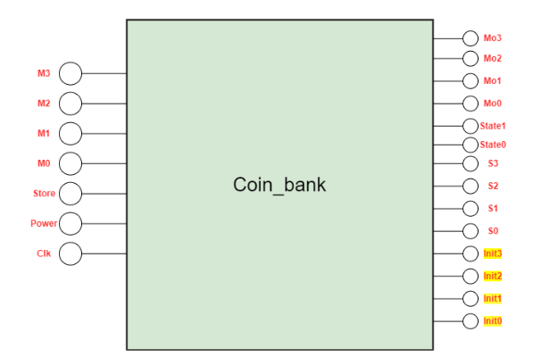
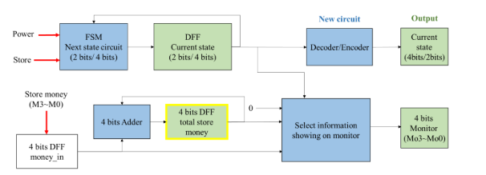
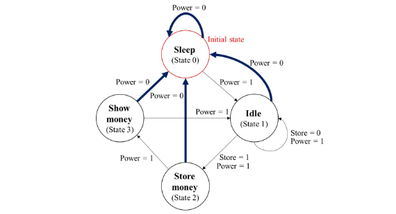
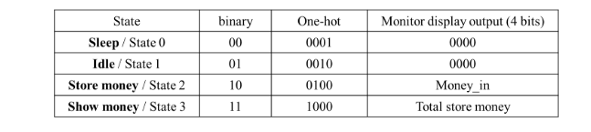
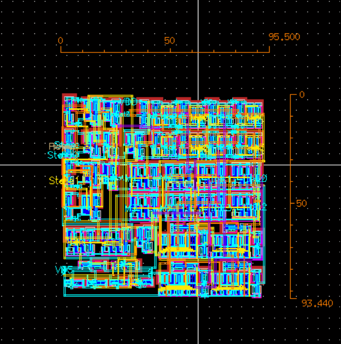

# Coin Bank
A coin bank designed in transistor level in Hspice and layouting is also done in virtuoso.

## Functions
To be more specific, the coin bank stores money and it can also show money in the monitor of what is the current amount in the bank, or how much money is put in the bank at that moment

block_diagram

The sample architecture of the coin bank

State Diagram

The monitor depending on the current state

## Pre Simulation
The pre-sim file is located at pre_sim folder which contains the pre simulation code writte in hspice

## Layout 
After the pre-sim the layout are then drawn using virtuoso.

Final layout

For more layout per different logic gate that is used, it is explained and shown in report.pdf

## Post Simulation
The post-simulation file is located at post_sim folder which contains the pex files generated by virtuoso. 

## Other Files
Area.txt : shows the width and length of the layout
Clock_cycle.txt : The clock cycle used to run the coin bank

## Change Log
clock cycle of pre-sim of 1ns does not work that well. Hence, both pre-sim and post-sim is change to 3ns. However, there might also be an error in logic of the pre-sim and the sample architecture. Another Mux might be needed to solve this problem. 

